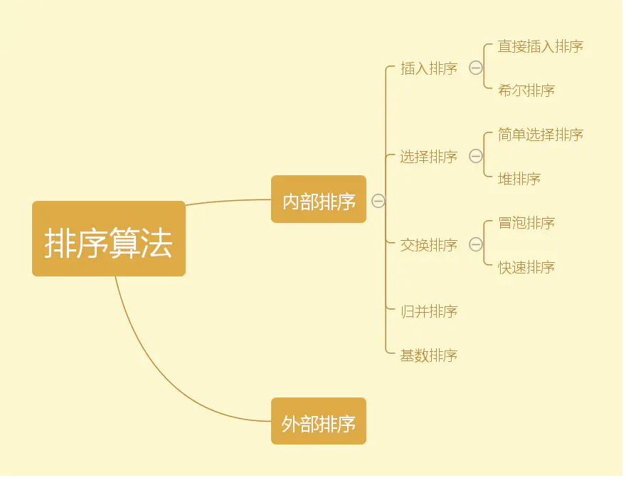
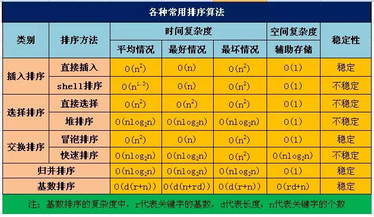

- [实现phpasort](asort.php)
- [快速排序](quickSort.php)
### 常见排序算法及性能

> O(1) < O(log2N) < O(N) < O(N * logN) < O(N^2) < O(N^3)  < O(N!)

### 算法五大思想
#### 分治算法
#### 动态规划 
> 一般用来求最优解
1. 判断是否可用递归来解
    > 递归问题解决思路
    1. 先定义一个函数
    1. 接下来寻找问题与子问题间的关系
    1. 将第二步的递推公式用代码表示出来补充到步骤 1 定义的函数中
    1. 根据问题与子问题的关系，推导出时间复杂度,如果发现递归时间复杂度不可接受，则需转换思路对其进行改造，看下是否有更靠谱的解法
2. 分析在递归的过程中是否存在大量的重复子问题
3. 采用备忘录的方式来存子问题的解以避免大量的重复计算（剪枝）
4. 改用自底向上的方式来递推，即 dp 解法
#### 贪心算法
#### 回溯法
#### 分支限界法
