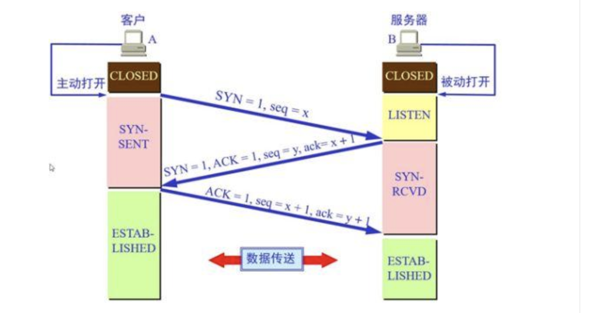

### 三次握手
   同步双方的序列号和确认号，并交换tcp的窗口大小
   1. 客户端向服务端发送一个包含 初始序列号x + 窗口大小 的tcp报文
   2. 服务器接到报文后， 回复一个 初始序列号y + 确认客户端序列号x+1 + 窗口大小 tcp报文
   3. 客户端接受到服务端报文后， 发送 确认序列号y+1 + 序列号x+1 报文

   **注意**： 三次握手而不是俩次握手主要为了防止已经过期连接再次传到被连接的主机。如果俩次握手可能服务器产生一些无用的连接

  **三次握手过程**：
  
  **四次挥手过程**:
  

## tcp 和 udp 区别
- TCP
  - 面向连接： 一对一通信
  - 字节流：通信双方发送和接受次数不同，发送：先放进缓冲区，可以一次性发送；接收方，可以一次从接受缓冲区读取，也可以分批次读取
  - 可靠传输：TCP采用应答机制，超时重传（有个超时重传定时器），可以对接受到的报文重排整理在交付应用层。慢启动（平滑的增大拥塞窗口）和拥塞控制（发送端一次向网路写入的数据量（发送窗口）的控制）
- UDP
  - 无连接：非常适合广播和多播
  - 数据报：发送端应用程序每执行一次写，接收端必须及时针对每个UDP包执行读操作
  - 不可靠服务：需要上游服务来处理数据确认和超时重传

||tcp|udp|
|:-:|:-:|:-:|
|连接性|面向连接|无连接|
|可靠性|可靠|不可靠|
|传输内容|字节流|报文段|
|传输速度|一般|比tcp快|
|流量控制|有滑动窗口|无|
|拥塞控制|有 慢启动，拥塞避免，快重传和快恢复|无|

## IP 协议
> IP 协议是 TCP/IP 协议簇的动力，为上层协议提供无状态、无连接和不可靠的服务。IP 头部信息指定IP通信的源端IP地址、目的端通信地址，知道IP分片和重组，以及部分通信行为。
- 无状态：IP通信双方不同步传输数据的状态信息，IP数据包的发送、传输和接受都是独立的，没有上下文关系。优点：简单、高效
- 无连接：IP 通信双方都不长久地维持对方的任何信息
- 不可靠： IP 协议不能保证IP 数据包准确地到达接收端，只承诺尽最大努力。因此上层协议（tcp）需要自己实现数据的确认、超时重传等机制达到可靠传输的目的

### 四次挥手
    1.  A端发起断开连接，A关闭向B发送数据
    2.  B回复A，停止接受A端数据
    3.  B发送A  停止向A发送数据
    4.  A回复B  关闭接受A的数据

### 完整的http请求
但我们在浏览器输入一个地址的时候，发生的事情
域名解析->发起tcp3次握手->建立连接后发起http请求->服务器响应http请求，浏览器得到html代码->浏览器解析html代码,并请求html代码中的资源(js, css, imge)->浏览器对页面进行渲染呈现给用户
- 域名解析
 - 浏览器自身DNS缓存
 - 操作系统自身的DNS缓存
 - hosts文件
 - DNS系统调用(运营商提供的)
- 发起TCP三次握手，建立连接
- 发起http请求
- 响应http请求，返回html代码
- 解析html代码，请求资源
- 页面渲染，呈现

### Nginx

1. nginx 的负载均衡实现方式
 - round-robin 默认,轮询/权重轮询
 - least-connected,最少连接数/权重最少连接
 - ip-hash,用户ip哈希

2. Nginx, CGI, FastCgi, php-fpm之间的关系
  - CGI 是什么？
    - CGI是协议，保证web server(Nginx)传递过来的数据是标准格式。
    - （每个请求）server接到动态文件 启动/交给cgi解释器（php-cgi）
      1. cgi会解析php.ini
      2. 初始化执行环境，
      3. 执行请求，
      4. 返回cgi格式数据给server，
      5. 退出进程。
  - FastCgi 是什么？
    - FastCgi是用来提高CGI程序性能的，也是协议
      1. FastCgi启动一个master，解析php.ini文件，初始化执行环境，
      然后在启动多个worker
      2. 接到请求，master传递给一个worker处理。master可以接受下一个请求。master根据配置预先启动多个worker等着，多余的worker可以停掉。避免每次重启cgi，节省时间，提高性能。
 - php-fpm 是什么？
    - 是实现了FastCgi的程序
    - php-cgi是php的解释器，只是一个cgi程序，本身只能解析请求，返回结果，不会进程管理。php-fpm就是可以调度php-cgi进程的程序。

# 5 层网络模型
|名称|涉及协议
|:-:|:-:
|应用层|HTTP、HTTPS、FTP、SMTP
|传输层|TCP、UDP
|网路层|ICMP、IGMP、IP、ARP、RARP
|数据链路层|
|物理层|

ARP：地址解析协议，IP地址转物理地址。在主机 **ARP高速缓存**中存放一个本局域网IP地址到物理地址到映射表，还经常动态更新该表。第一次没有映射的时候，通过局域网广播一个ARP 请求，获取某个IP 的物理地址
ICMP：网际控制报文协议，为了更有效的转发IP数据包和提高成功交付的机会。例如终点不可达、源点抑制、时间超时、参数问题等路由或者主机将向源点发送相关错误报文

