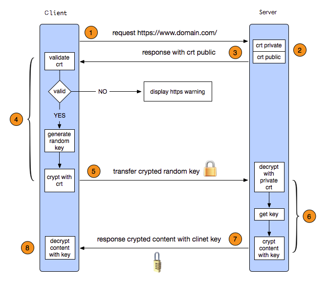

### HTTP 协议
1. 浏览器向 DNS 服务器请求解析该 URL 中的域名所对应的 IP 地址;

2. 解析出 IP 地址后，根据该 IP 地址和默认端口 80，和服务器建立TCP连接;

3. 浏览器发出读取文件(URL 中域名后面部分对应的文件)的HTTP 请求，该请求报文作为 TCP 三次握手的第三个报文的数据发送给服务器;

4. 服务器对浏览器请求作出响应，并把对应的 html 文本发送给浏览器;

5. 释放 TCP连接;

6. 浏览器将该 html 文本并显示内容; 　

### HTTP 常用返回码
- 2XX 请求正常完成
- 3XX 代表网站重定向
  - 304 未按预期修改文档
  - 302 临时重定向
  - 301 请求的数据具有新的位置，并且更改是永久的
- 4XX 客户端出现错误
  - 403 网站拒绝显现此网页，
  - 408/409 网站太繁忙
- 5XX 服务端出现错误

### https 协议
>HTTPS（超文本传输安全协议） 是 HTTP + SSL/TLS，是一种通过计算机网络进行安全通信的传输协议，提供对网站服务器的身份认证，保护数据传输的完整性、安全性。

> 数字证书的公钥和私钥可以理解为锁头和钥匙，

如图：

1. 客户端发起一个 https 请求，连接到 server 的 443 端口

1. 服务端返回证书（公钥）

1. 客户端解析证书，验证颁发机构，有效期等

1. 客户端验证通过，生成一个随机 key，并用上一步返回的公钥加密返回服务端

1. 服务端用私钥解密传过来的数据，得到客户端生成的key

1. 服务端用得到 key 对称加密返回的内容给客户端
ß
1. 客户端用 key 解密服务器返回数据，等到结果

### socket 协议
1. 服务端先用 socket 函数创建一个套接字，调用 Bind 绑定IP 和 端口，调用 listen 函数使服务端的 ip 和端口处于监听状态，等待客户端的连接

1. 客户端用 socket 函数建立一个套接字，设定远程 ip 和端口，并调用 connect 函数像服务端发起连接

1. 服务端用 accept 函数来接受远程计算机的连接，建立起与客户端的连接

1. 完成通信以后， 最后使用 close 函数关闭套接字

### websocket 协议
1. WebSocket 他是为了解决客户端发起多个http请求到服务器资源浏览器必须要经过长时间的轮训问题而生的
1. websocket 是一种双向通信协议，采用异步回调的方式接受消息。当建立通信连接，可以做到持久性的连接，并进行通信
1. websocket 也需要通过握手连接，类似于 TCP 也需要客户端和服务器端进行握手连接， 连接成功后才能相互通信
1. 建立连接后，websocket 服务器和 Browser 都能主动向对方发送和接受数据， 实质的推送方式是服务器主动推送，只要有数据据推送到请求方

[数字签名和数字证书](http://www.ruanyifeng.com/blog/2011/08/what_is_a_digital_signature.html)
- 数字签名是保证数据完整性的
- 数字证书是加密用的
