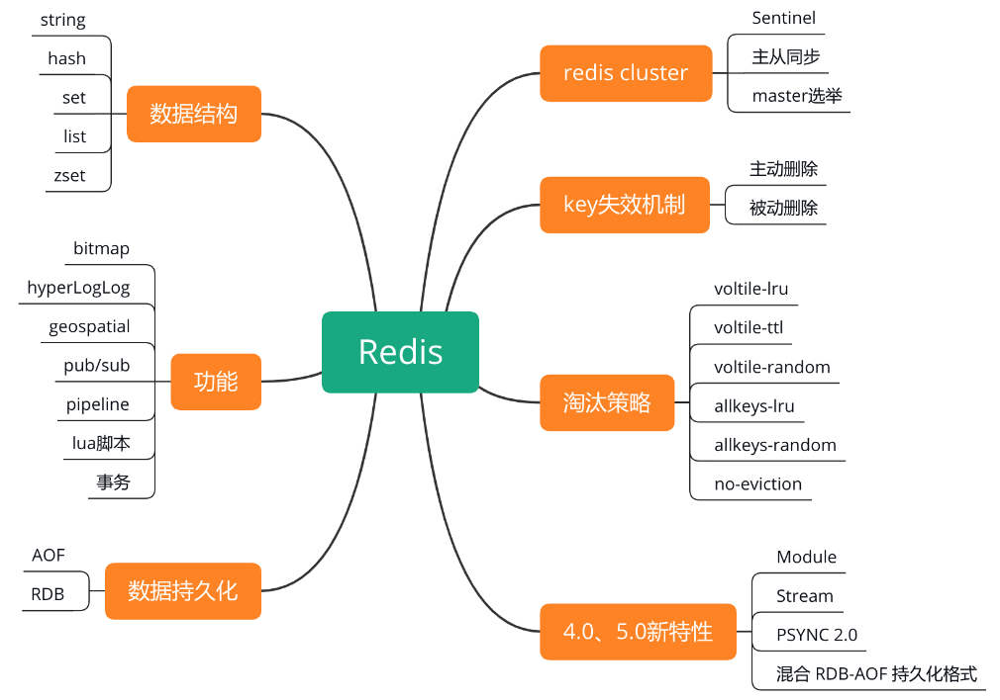

## Redis 知识点

## Redis 持久化 ##
   - RDB：
      - 优点：
          - 文件紧凑，适用于备份数据。
          - 紧凑的单一文件，方便传送，适合灾难恢复。
          - 持久化方式可以最大化redis的性能。//通过fork子进程做io操作
          - 恢复大的数据比AOF快
      - 缺点：
          - 意外断电，或者宕机会损失 间隔的数据
          - 当数据比较大的时候，fork子进程过程很耗时，无法响应客户端。AOF也需要fork子进程，但可以调节重写日志频率，提高数据集的耐久度。
   - AOF：
        - 优点:
              - redis更加耐久，可以使用不同fsync（）策略。
              - 当AOF文件体积过大时，后台可自动对文件重写。
              - AOF文件有序保存了对数据执行的所有写入操作，容易读懂，分析。
              - AOF只是进行追加日志文件。
        - 缺点：
              - 对相同数据集，AOF体积相对大于RDB体积
              - 根据使用的策略，速度可能慢于RDB，处理巨大的写入，RDB可以保证最大延迟时间。

## Redis 复制 ##
   配置：在slave配置文件加 slaveof 192.168.1.1 6379

## Redis 管理 ##
   - 安装，
       - linux ，向/etc/sysctl.conf添加vm.overcommit_memory = 1然后重启
       - 禁用Linux内核特性transparent huge pages， 过命令echo never > sys/kernel/mm/transparent_hugepage/enabled来完成。
   - 重启升级
       - 配置slave，
       - 等待复制同步完成， 使用config set slave-read-only no，允许写slave。
       - 配置所有客户端使用新的实列
       - 确认住实列不再接受任何请求，使用 SLAVEOF NO ONE 命令切换从实例为主实例，然后关闭原先的主实例。
## Redis 安全 ##
   - 网路安全：
       - redis.conf配置 bind 127.0.0.1//只有本地用户可以访问
       - 防护墙屏蔽redis端口
   - 常规安全设计： Redis被设计成仅有可信环境下的可信用户才可以访问。
   - 认证的特性： 开启认证授权方式， 密码尽量长。
   - 禁用或者重命名特殊命令：在redis.conf配置文件中， rename-command $command sfsdfsafs/"" //空是禁用命令
   - 控制运行redis服务器用户的权限。

**全部数据类型都可以用：exists, del, type, expire, persist, ttl**
- string : set, get, getset, mset, mget, incr, decr, decrby,
> 使用场景：计数器、共享session等一些缓存地方

- list : lpush, rpush, lrange, lpop, rpop, ltrim, blpop, brpop, rpoplpush, brpoplpush, llen,
> 使用比较广泛，如热门的列表型的数据结构：粉丝列表，文章的评论列表。也可以基于列表做简单的高性能分页，

- hash : hmset, hget, hgetall, hmget,
> 类似 hashmap 的数据结构，可以将结构化的数据（不能锲套）存储到缓存，每次读写，可以仅仅操作某个字段。

- set : sadd, scard, interset(交集), sdiff(相减)，
> 是无序集合， 可以用来去重。也可以用来做 交集，并集，差集等操作。例如，俩人的共同好友

- sorted set: zadd, zrange, zrevrange, zremrangebyscore,  zrangebyscore, zrank, zrevrank
> 有序的去重集合；排行榜，带权重的队列

- bitmaps:
> 位图是支持按 bit 位来存储信息，可以用来实现 布隆过滤器（BloomFilter)

- Geospatial:
> 可以用来保存地理位置，并作位置距离计算或者根据半径计算位置等。有没有想过用Redis来实现附近的人

- pub/sub
> 功能是订阅发布功能，可以用作简单的消息队列

- Pipeline：
> 可以批量执行一组指令，一次性返回全部结果，可以减少频繁的请求应答

**lua 脚本**：redis.call() redis.pcall(),  redis.error_reply(), redis.status_reply()
         脚本是原子执行的
         脚本缓存 刷新命令（script flush）
         script命令 ： script flush, script exists, script load, script kill

**事物**: multi, exec, discard, watch, unwatch

## 内存优化技术：##
- 内存压缩技术（特殊编码技术 ）
- 尽可能使用散列表，hashes
- 使用位级别和字级别操作
- 设置maxmemory
- 使用散列结构高效存储抽象的键值对。

## 插入大量数据 ##
- 差： (cat data.txt; sleep 10) | nc localhost 6379 > /dev/null
- 好： cat data.txt | redis-cli --pipe

## Raft 算法和 Gossip 协议
- [Raft 算法动态演示](http://thesecretlivesofdata.com/raft/)
- [raft算法 和 Gossip协议](https://www.backendcloud.cn/2017/11/12/raft-gossip/)

## 一致性hash算法
> 一致性Hash算法（Consistent Hashing）是一种hash算法，它能够在Hash输出空间发生变化时，引起最小的变动
- 平衡性
   > 是指哈希的结果均匀地分配在整个输出空间中
- 单调性
   > 当发生数据节点变动时，对于相同的数据始终映射到相同的缓冲节点中或者新增加的缓冲节点中，避免无法找到原来的数据
- 稳定性
   > 当出现节点坏掉或热点访问而需要动态扩容时，尽量减少数据的移动

## 缓存雪崩，穿透和击穿解答，及预防
- 缓存雪崩：大批的 key 设置同时过期，大量的请求同时打到数据库
> 同一批key，过期时间可以加 随机值，或者热的数据永不过期
- 缓存穿透：缓存和数据库都没有的数据，但是用户却不断的请求
> 接口参数，访问权限做校验，也可以在网关层单个IP每秒访问次数超出阈值的IP都拉黑。或者把不在缓存，也不在数据库的 key 的 value 存成null， 不存在的值， 稍后在访问等，时间可以稍微短点。 也可以使用布隆过滤器，提前把存在的 key 在布隆过滤器过一遍，不存在的直接返回。
- 缓存击穿：和缓存雪崩相似，但不同点在于，大的并发集中在一个key上，当这个 key 失效的瞬间，请求全部打到数据库
> 可以设置热点数据永不过期，加互斥锁

1. 事前： Redis 高可用： 主从 + 哨兵， Redis Cluster，避免全面崩溃
2. 事中：本地缓存 + 限流 + 加降级， 避免 MYSQL 被打死
3. 事后： Redis 持久化，RDB+AOF 一旦重启自动从磁盘加载数据，快速恢复缓存数据

## Redis 哨兵
- 集群监控：负责监控 Redis master 和 slave 进程是否正常工作
- 消息通知：如果某个 Redis 实例有故障，那么哨兵负责发送消息作为报警通知给管理员
- 故障转移：如果 master node 挂掉了，会自动转移到 slave node 上
- 配置中心：如果故障转移发生了，通知 client 客户端新的 master 地址

## Redis 和 Memcached 有啥区别，为啥选择用Redis作为你们的缓存中间件？
- Redis 支持复杂的数据结构，更多的数据结构，更丰富的数据操作
- Redis 支持原生的集群模式， 而 Memcached 没有原生的集群模式，依赖于客户端分片写入
- Redis 是单核系统，而 Memcached 支持多核，所以在平均每一个核上，存储小数据的时候， Redis 高效。 但是存储 100K 以上数据的时候， M 更高效

## redis 的线程模型
> Redis 服务器是一个事件驱动程序，包括俩种类型的事件， 文件事件和时间事件。文件事件处理器使用 I/O 多路复用程序来同时监听多个套接字，并根据套接字目前执行的任务来为套接字关联不同的事件处理器。
文件事件处理器的构成
- 多个套接字
- I/O 多路复用程序
- 文件事件分配器
- 事件处理器（命令请求处理器，命令回复处理器，连接应答处理器）
> 尽管多个文件事件可能会并发的出现，但 I/O 多路复用程序会将所有产生事件的套接字放进一个队列，然后通过这个队列，以有序、同步、以每次一个套接字的方式向文件事件分配器传送，等关联的事件处理器处理完后，再次分配

## 过期键的删除策略
- 定时删除：在设置键的过期时间的时候，同时设置一个定时器，在键的过期时间来临，立即删除键。 优缺点： 对内存友好，对 CPU 不友好。影响服务器响应时间和吞吐量
- 惰性删除：程序只会在访问键的时候，才去检查是否过期。删除键只有在非不得已才进行，优缺点：对 cpu 友好，不会访问的键也许永远都不会删除（有内存泄漏风险）
- 定期删除： 每隔一段时间执行一次删除过期键操作，通过限制删除操作的频率和执行时间，