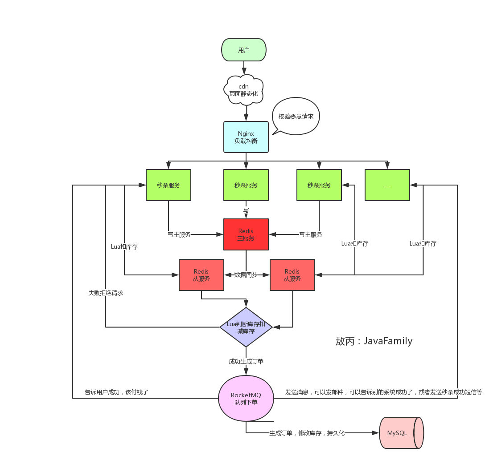

# 如何围绕 redis 设计一个秒杀系统

## 为啥 redis 那么好？
> Redis采用的是基于内存的采用的是单进程单线程模型的 KV 数据库，由C语言编写，官方提供的数据是可以达到100000+的QPS，
- 完全基于内存的操作
- 数据结构简单，操作也简单
- 采用单线程，避免上下文切换和竞争条件
- 使用多路 I/O 复用情况，非阻塞 I/O
- 使用底层模型不同

## 秒杀系统存在的问题
- 高并发 （缓存雪崩， 缓存击穿， 缓存穿透）
- 恶意请求
- 链接暴露
- 超卖

## 设计注意到点
- 资源静态化
> 现在的系统一般是前后端分离的，有些前端资源可以提前放到 CDN服务器中 
- 按钮置灰
> 活动开始前，或者用户点击后返回前置灰，减少请求次数
- 服务单一
> 秒杀服务单独部署（微服务设计，分布式部署），使用单独的库表，建立索引。即使该服务崩了，也不影响其他系统
- 秒杀链接处理
> 注意秒杀链接不能提前暴露，链接生成动态化
- Redis 集群化
> 主从同步，读写分离，外加哨兵高可用
- 负载均衡，恶意请求拦截
> Nginx 并发可以达到万级别
- 限流，前端限流加后端限流
> 前端通过按钮置灰操作，一旦秒杀活动结束，后端立刻停止接受请求或者使用一些限流组件
- 库存预热
> **秒杀的本质是抢占库存** ，如果每次都查询商品、库存校验、扣减库存， 流程繁琐，对业务开发不友好，数据库也无法支撑。可以提前把商品库存加载到 Redis 中，后面的整个流程可以都到 Redis 操作，等秒杀结束在异步去修改数据库。
- Redis 采用主从，超卖如何避免
> 可以使用 lua 脚本， lua 脚本类似 redis 的事务操作，具有原子性，避免其他任务插队，可以完成 redis 的一些事务性操作。可以将库存判断和扣减库存放在一个lua脚本去做。当一个失败，修改开关，直接挡住所有的后续请求。
- 限流&降级&熔断&隔离
> 限流：多余的流量挡在外面； 降级：去掉访问一些次要的资源；熔断：当影响到其他业务的时候，停止访问该接口；隔离：不要拖累受影响的系统
- 削峰填谷
> 可以使用 MQ ，当大量操作进来时，可以把请求放进 MQ，然后一点一点的去消费
