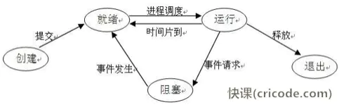
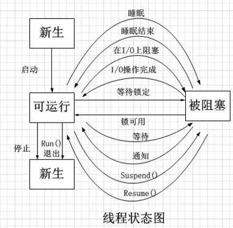

### 进程的地址空间

### 进程和线程
- 进程是资源分配调度的基本单位 fork/vfork
- 线程是cpu分配调度的基本单位 pthread_create
    - 寄存器：每个线程都有一组cpu寄存器，称为上下文，暂存指令、地址和数据
### 进程状态
- 运行
- 就绪
- 阻塞

### 线程状态
- 新生
- 可运行
- 被阻塞
- 死亡

### 进程间通信
管道、有名管道、消息队列、信号、信号量、共享内存、套接字

### 进程调度常用算法 ###
1. 先来先服务（FIFO）
1. 短进程优先
1. 基于优先级的调度算法
1. 反馈调度算法- 先调度优先级高的队列，在同级队列使用时间片轮转
1. 时间片轮转算法
### 页面替换算法 ###
1. 最佳置换算法（OPT）	   未来最久不使用的页换出或者最长时间不需要访问的页面
1. 先进先出（FIFO）
1. 改进型先进先出算法
1. 最近最久未使用（LRU） 
1. 时钟替换算法 - 每一次进行替换指针的位置就从替换数移到下一个位置,每一次进行访问时，则指针保持不动

### 死索产生的四个条件 ###
	1. 互斥条件
	2. 不剥夺条件
	3. 请求和保持条件
	4. 循环等待条件
### 死锁避免 ###
	1. 加锁顺序
	2. 加锁时限
	3. 死锁检测

### pc 缓存
- cpu 缓存（L1 Cache, L2 Cache）
- 内存（RAM）
  - 静态内存  特点：速度块，集成度低，价格高
  - 动态内存  特点： 集成度高，速度慢于静态
- 磁盘 缓存

### 网络缓存
- 浏览器缓存
- 代理缓存

### 分布式缓存
- memcached
- redis

### 虚拟内存
> 为了有效管理内存减少出错
1. 将主存看成是一个存储在磁盘的地址空间
2. 为每个进程提供了一致的地址空间
3. 保护每个进程的地址空间不被其他进程破坏

[深入理解计算机操作系统参考网站](http://csapp.cs.cmu.edu)
